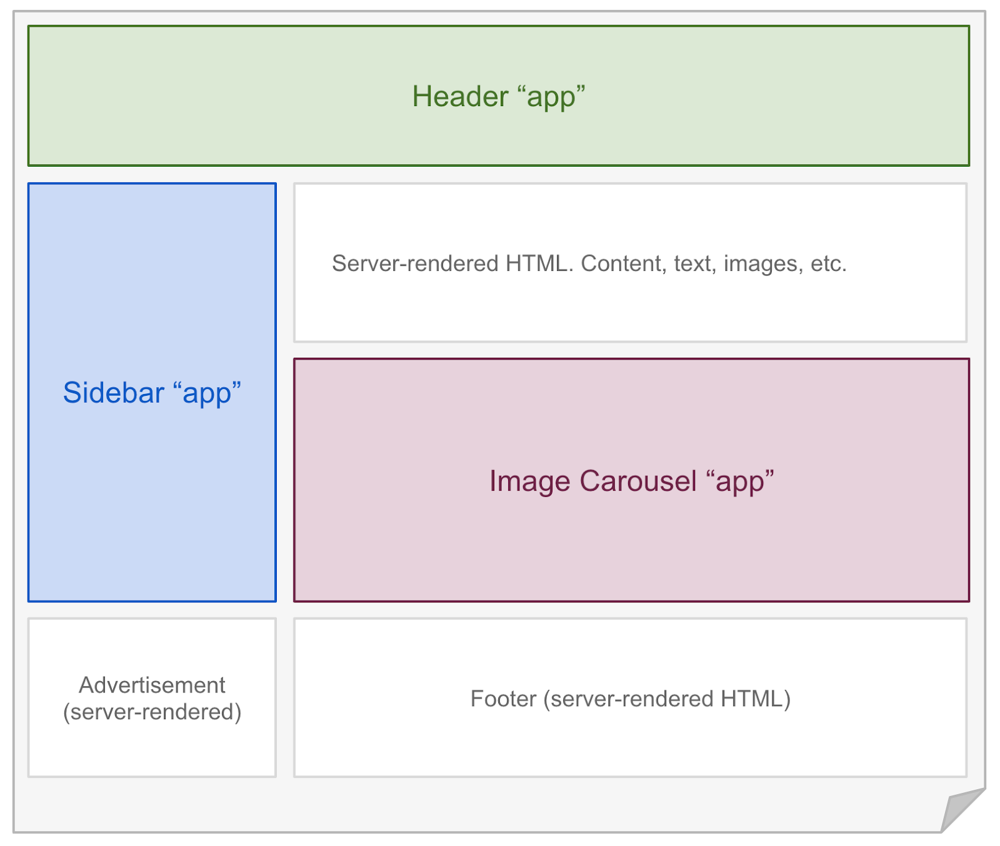

class: middle center no-number

  

  

    
      Fresh の紹介
    
    <small>Yoshiya Hinosawa</small>
  

---

# 
Fresh とは

- Deno 向けのフロントエンドフレームワーク
- Next.js に似たファイルベースルーティングの仕組み
- View は Preact (軽量 React) で記述
- アイランドアーキテクチャを採用

---

Fresh アプリのディレクトリ構造

---

Fresh アプリのディレクトリ構造

3つの特別なディレクトリ

- `routes/`
- `static/`
- `islands/`

---

Fresh アプリのディレクトリ構造

`routes/`

- ファイルがそのまま URL になる
  - `routes/index.tsx` => `ドメイン名/`
  - `routes/about.tsx` => `ドメイン名/about`

--

 

Next.js, Nuxt, Remix などと同様

---

Fresh アプリのディレクトリ構造

Route ファイルの例

---

Fresh アプリのディレクトリ構造

- View - Preact
- Style - Tailwind (将来的にはSass等も対応予定)

---

Fresh アプリのディレクトリ構造

`static/`

- ファイルがそのまま配信される
  - `static/favicon.ico` => `/favicon.ico`
  - `static/style.css` => `/style.css`
  - `static/image/hero.png` => `/image/hero.png`

---

Fresh アプリのディレクトリ構造

`islands/`

- ファイルがアイランドコンポーネントになる

---
class: middle center inverse

アイランド(island)とは

---

Fresh のアイランドアーキテクチャ

アイランド(島) = ページ内の特定の部分を表す言葉

---

Fresh のアイランドアーキテクチャ

特定のアイランドにだけ JS を適用する

---

Fresh のアイランドアーキテクチャ

インタラクションのない部分の JS は配信しない

---

Fresh のアイランドアーキテクチャ

- `islands/` 以下のファイルはアイランドコンポーネント
- アイランドコンポーネントでは、View の動きを記述出来る
  - ex. onClick, useState

---

Fresh のアイランドアーキテクチャ

- 逆に、アイランドではない場合、動きは記述出来ない (記述しても無視される)
  - アイランドではないコンポーネントはほぼテンプレートエンジンと同じ

--

---
class: middle center bg-light-yellow

Fresh の良いところ

---
Fresh の良いところ1

# パフォーマンスが良い

- デフォルトで JS を吐かない
- アイランドコンポーネントを書いた部分だけ JS が配信される
  - JS の量が少なくなる => 速い
- Core Web Vitals を計測すると実際良い数値が出やすい

---
Fresh の良いところ2

# DX (開発体験) が良い

- Fresh の依存関係は Deno が実行時に自動的に解決してくれるので `npm install` 的なものがない
- Fresh はソースコードから直接 HTML や JS を生成するため「ビルド」のステップがない
- TypeScript は Deno がやってくれるので設定無しで TypeScript を使える

--

🙌サイトの開発に集中できる🙌

---
Fresh の実績

- Deno 関連の Web サイトはほぼ大体 Fresh で書かれている
  - ex. 公式ホームページ、マニュアル、
- [Fresh Showcase](https://fresh.deno.dev/showcase) というページに実例がたくさん

---
class: middle center

今なら Deno Deploy にデプロイすれば無料でインターネット上でサイトを公開出来ます。

---

## まとめ

- Fresh は Deno 用のフロントエンドフレームワーク
- アイランドアーキテクチャを採用しているため、描画のパフォーマンスが高い
- Next.js に似ているが、より良い開発体験を提供
- Deno 界隈では結構使用実績がある

---
class: middle center

Let's try fresh!

`deno run https://fresh.deno.dev`

---
class: middle center

Thank you!
